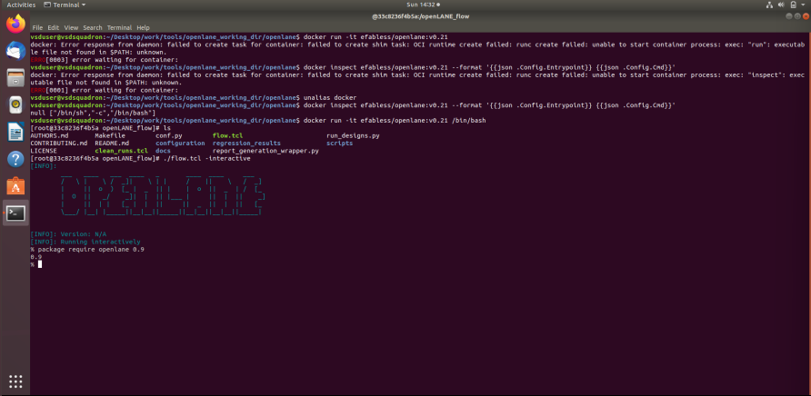
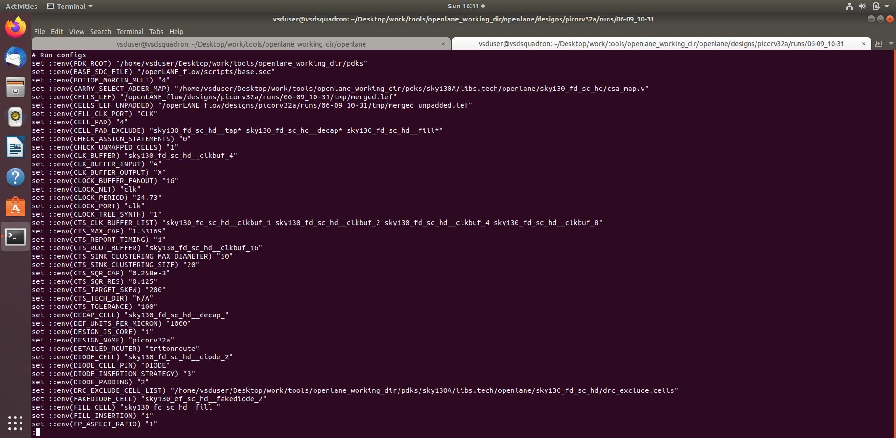
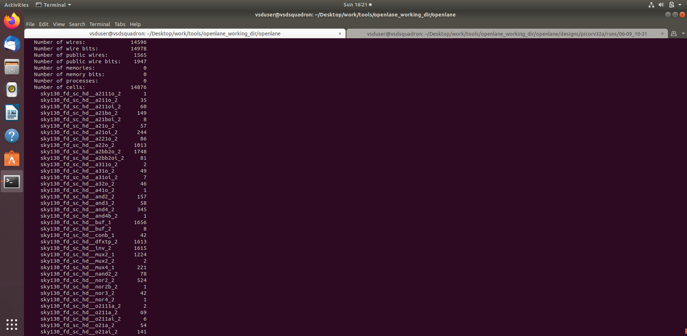
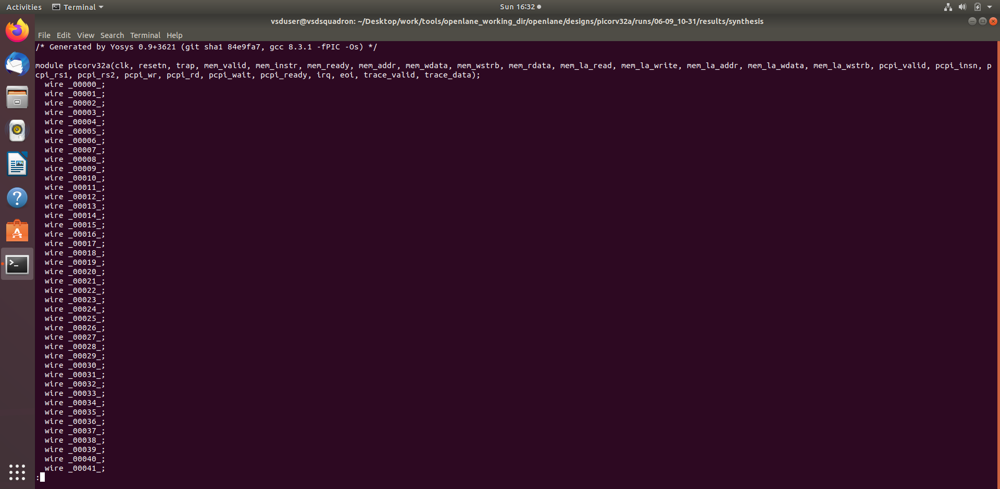

# Module 1: OpenLane Setup and Design Environment

This module introduces the initial setup for a digital design flow using OpenLane and the SkyWater 130nm process design kit (PDK). The focus is on getting the workspace ready and understanding how the design is configured before physical implementation begins.

## Objectives

- Set up the OpenLane environment
- Understand the SkyWater 130nm PDK structure
- Learn how configuration files drive the flow
- Explore how a design is synthesized and checked
- Interpret initial synthesis outputs

## Key Concepts

### OpenLane Workflow
OpenLane is an open-source ASIC design flow that brings together tools for synthesis, placement, CTS, routing, and final checks. In this module, the environment is prepared and the design begins to take shape through configuration and synthesis.

### PDK and Process Setup
The SkyWater 130nm PDK provides the process libraries and technology files needed for implementation. It forms the foundation for all the subsequent backend tasks.

### Design Configuration
Configuration files such as `config.tcl` define key parameters such as the design source, library usage, and flow behavior. These settings heavily influence synthesis and implementation decisions.

## Module Activities

- Environment setup for OpenLane
- Verifying the PDK and toolchain
- Inspecting configuration files
- Running synthesis and reviewing outputs
- Exploring generated reports and visual outputs

## Representative Outputs

## Typical Workflow

1. Prepare the toolchain and clone the required libraries
2. Configure the design using the appropriate TCL settings
3. Run the synthesis stage
4. Review warnings, reports, and generated files
5. Move to floorplanning and backend implementation stages

## Learning Outcome

After completing this module, you should be comfortable with the initial setup required for a physical design project and understand how the OpenLane flow is initiated.

---

This module acts as the entry point to the PD Program and prepares the foundation for all later physical design stages.
