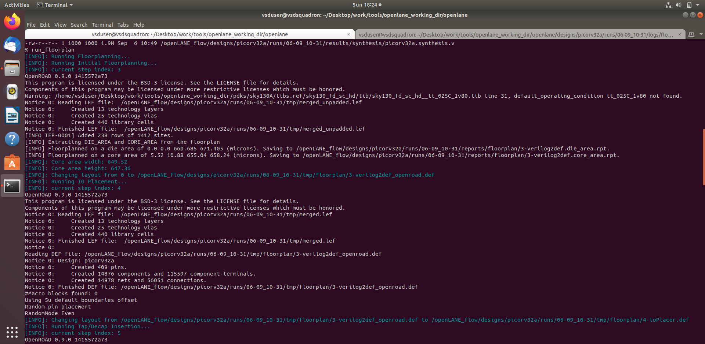
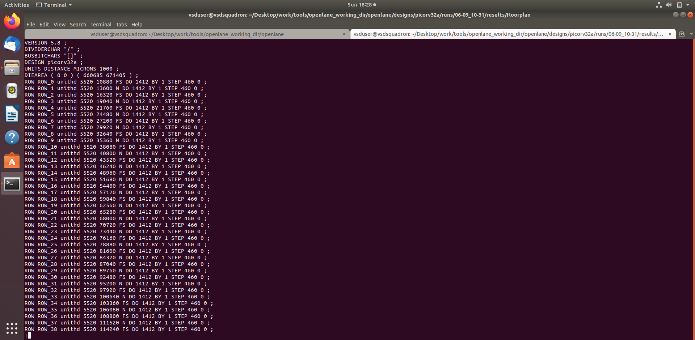
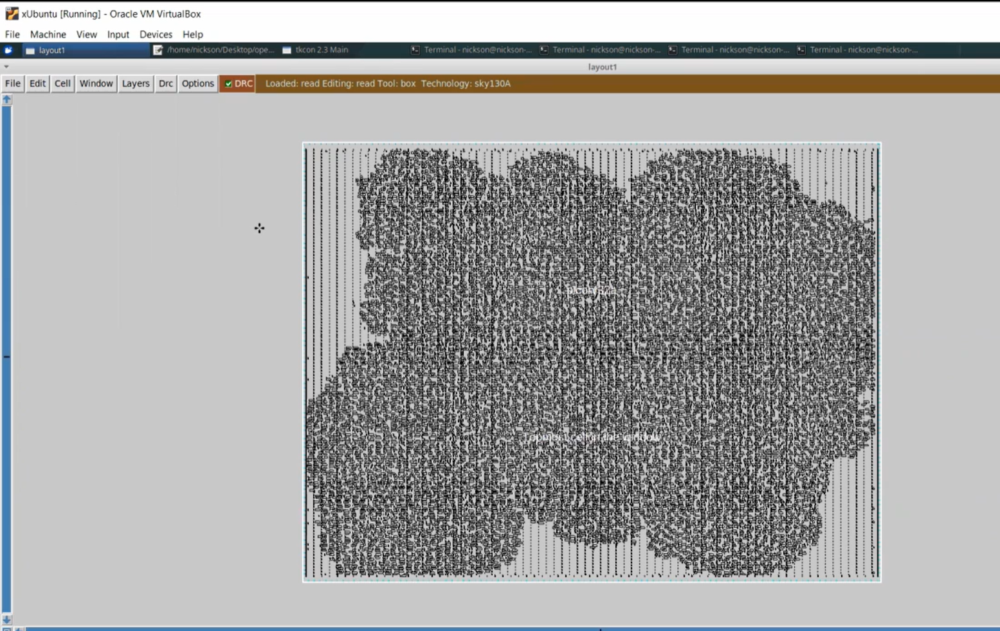
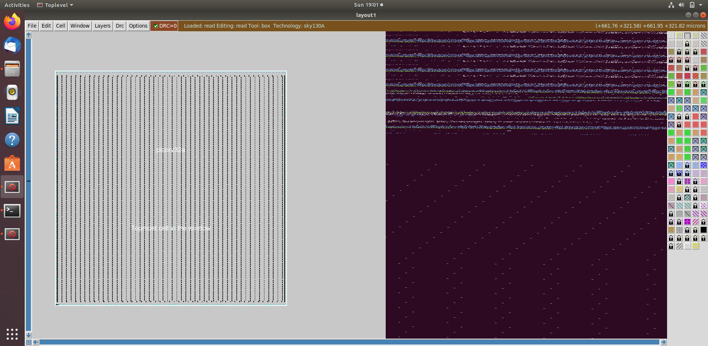
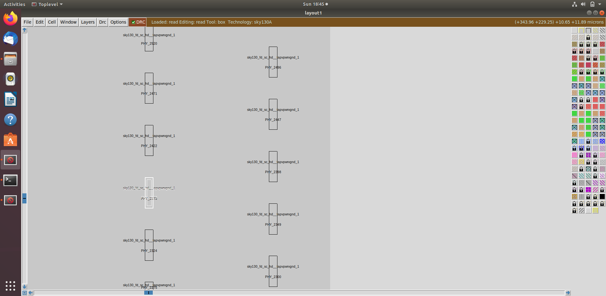

# Module 2: Floorplanning and Placement

This module focuses on one of the most important stages of physical design: floorplanning. A good floorplan determines how the chip area is organized and how efficiently design blocks can be placed and routed.

## Objectives

- Understand the concept of floorplanning
- Learn how to allocate chip area and define regions
- Inspect floorplan results and placement information
- Interpret layout and planner outputs
- Prepare for later stages like CTS and routing

## Key Concepts

### Floorplan
The floorplan defines the core area, I/O boundaries, and general organization of the chip. It is one of the first backend decisions that influences timing, congestion, and routability.

### Placement
After floorplanning, cells are placed in the defined area to meet logical connectivity while maintaining performance and manufacturability. Placement quality affects both routing and timing.

### Layout Visual Interpretation
The images in this module help understand how the placed design appears physically and how floorplan constraints are reflected in the final floorplan visualization.

## Module Activities

- Defining chip floorplan constraints
- Reviewing floorplan reports and geometry
- Observing placement at different stages
- Understanding the relation between logical connectivity and physical arrangement

## Representative Outputs

## Typical Workflow

1. Set up the floorplan configuration
2. Define core and I/O region boundaries
3. Run placement and review the resulting distribution
4. Check for congestion, spacing, and area efficiency
5. Continue to CTS and routing stages

## Learning Outcome

By the end of this module, learners should understand how floorplanning and placement shape the physical structure of a chip and influence design quality.

---

This module bridges synthesis and routing by establishing the physical layout foundation for the design.
