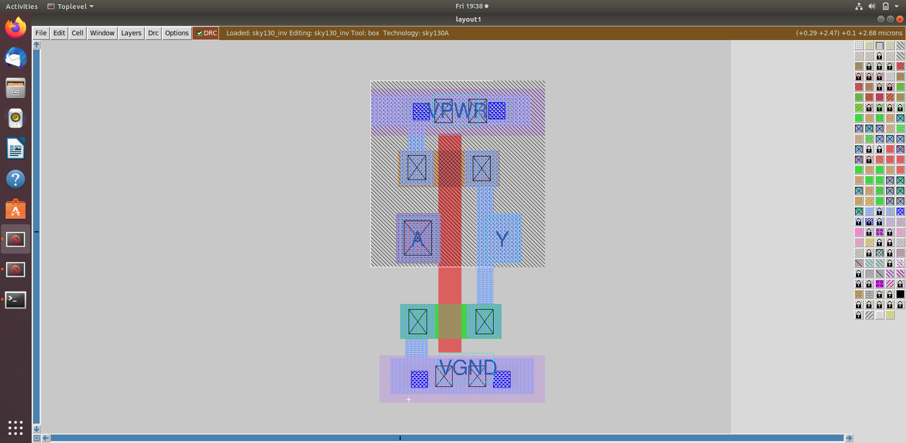
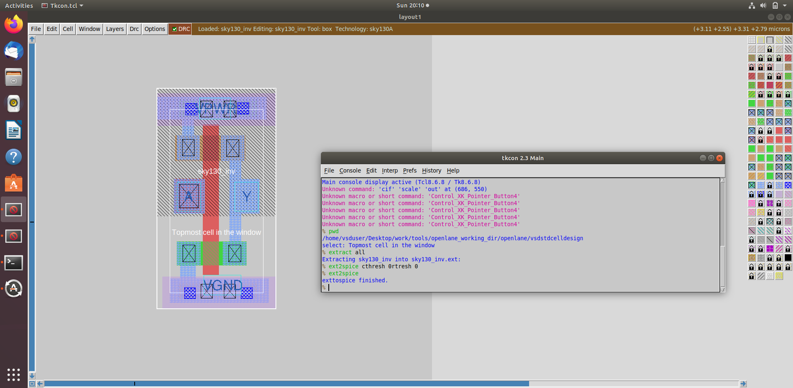
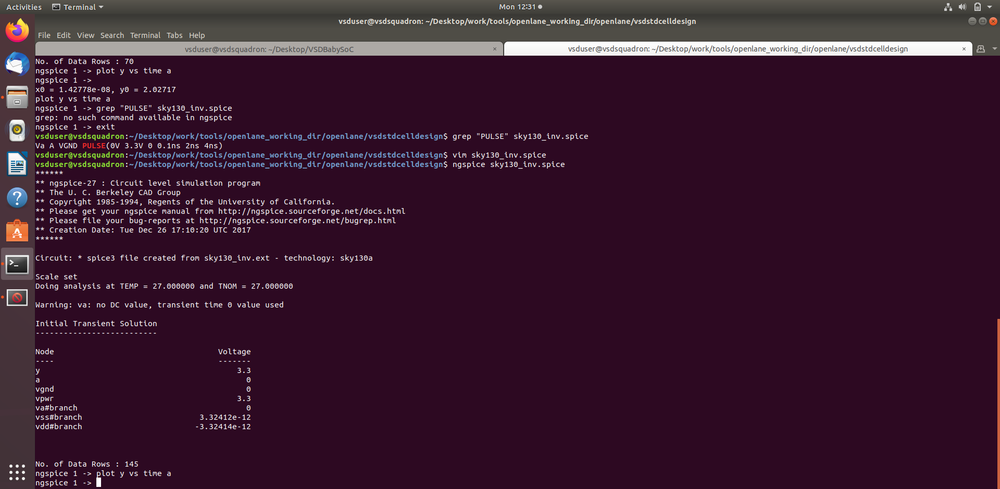
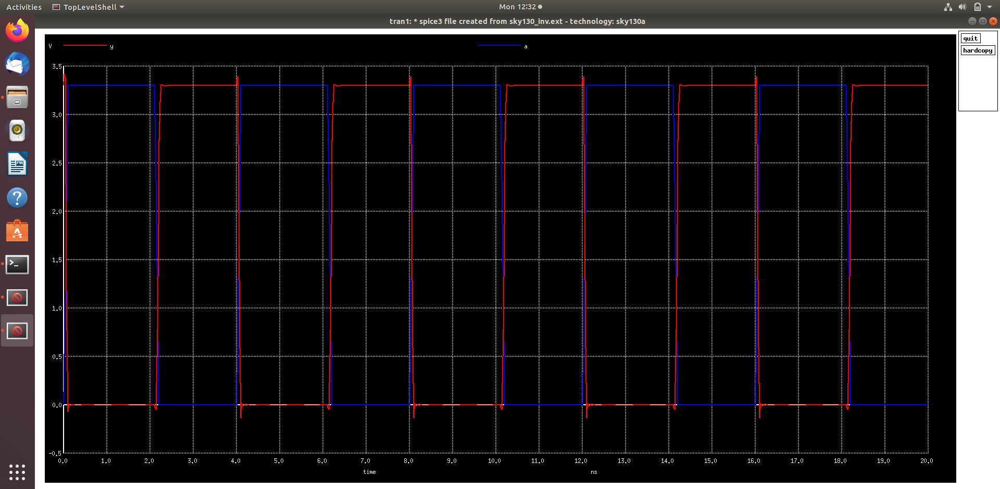
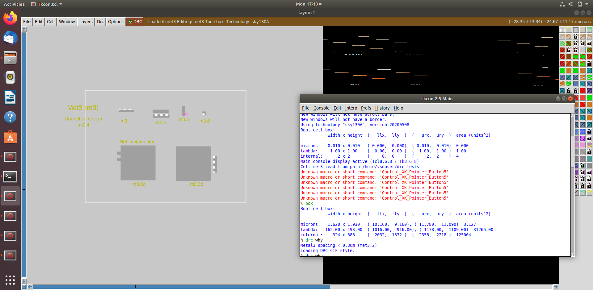

# Module 3: CMOS Design and Simulation with ngspice

This module introduces circuit-level design and simulation, focusing on the CMOS inverter and the use of ngspice for waveform analysis. It helps connect transistor behavior with digital logic concepts used in the higher-level ASIC flow.

## Objectives

- Understand CMOS inverter operation
- Learn transistor-level simulation using ngspice
- Interpret waveform results
- Connect circuit behavior to digital switching concepts
- Explore the SkyWater 130nm technology stack at transistor level

## Key Concepts

### CMOS Inverter
A CMOS inverter is one of the most fundamental digital building blocks. It demonstrates how complementary PMOS and NMOS devices together create a logic inversion with low static power and high noise margins.

### ngspice Simulation
ngspice is used to perform transient analysis and observe how the inverter responds to input transitions. The resulting waveforms provide evidence of switching behavior, delays, and rise/fall characteristics.

### SPICE-based Design Validation
Circuit-level design validation is essential before a design is relied on in larger RTL and physical implementation workflows. This module provides that beginner-level practical exposure.

## Module Activities

- Create and inspect CMOS inverter schematics
- Run SPICE simulations using ngspice
- Observe output response for switching events
- Analyze waveform plots and understand transistor behavior

## Representative Outputs

## Typical Workflow

1. Build or inspect the inverter circuit
2. Set up the SPICE simulation file
3. Run transient analysis using ngspice
4. Analyze voltage transitions and timing behavior
5. Cross-check the result with visual layout or schematic views

## Learning Outcome

By the end of this module, learners should be able to understand the physical principles behind the logic gates they later synthesize and place in ASIC design workflows.

---

This module anchors the ASIC flow in realistic semiconductor behavior and prepares learners for deeper backend design work.
