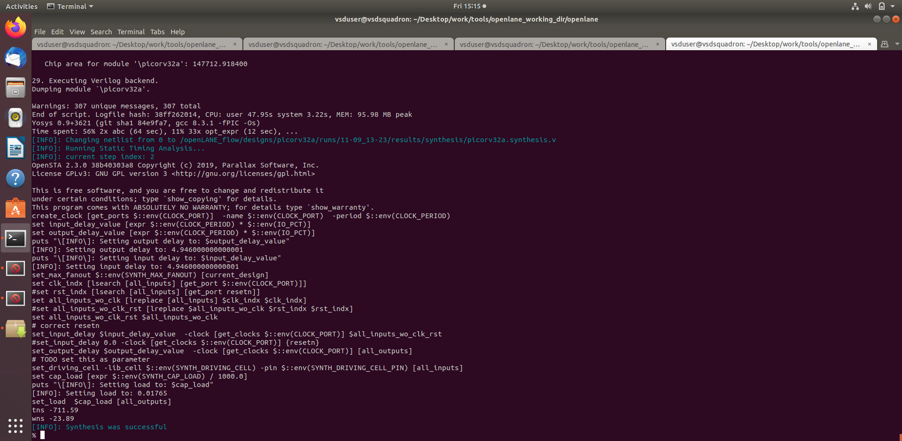
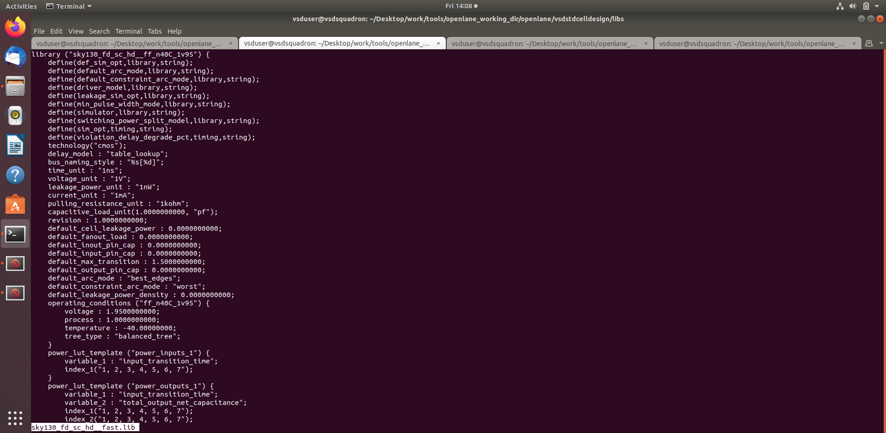
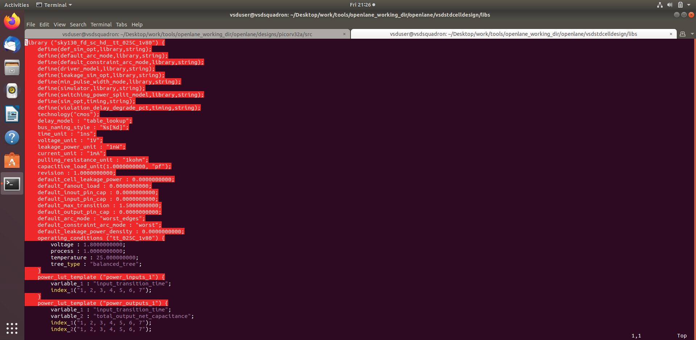
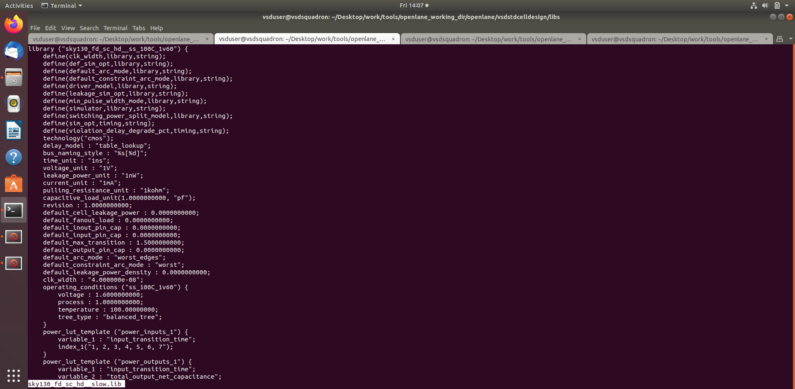
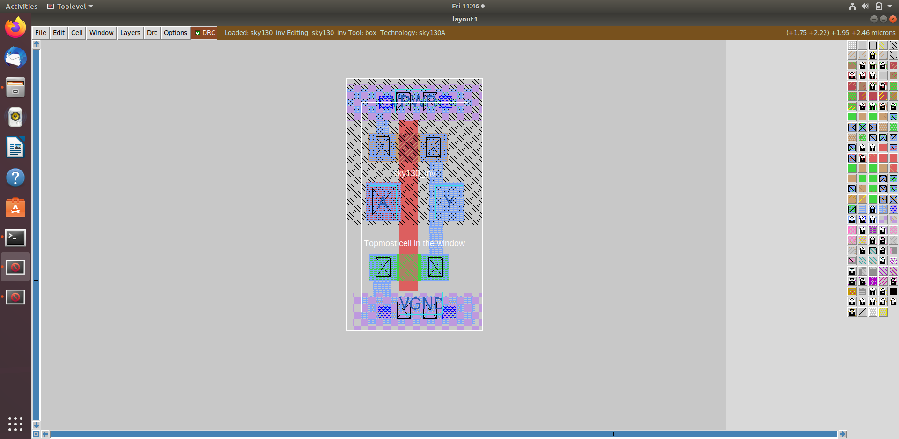

# Module 4: Synthesis and Timing Corner Analysis

This module focuses on converting HDL into a gate-level netlist and understanding how timing varies across process corners. Synthesis is a key step in the ASIC flow and determines whether the digital design can meet timing and functionality requirements.

## Objectives

- Understand the logic synthesis process
- Interpret synthesis reports and netlist generation
- Assess timing across multiple process corners
- Learn how libraries and process conditions affect design behavior
- Review corner-specific design behavior in SkyWater 130nm.

## Key Concepts

### Synthesis
Synthesis translates a high-level RTL description into logic gates based on target library cells. It is the step where the design becomes implementation-aware and is optimized to match constraints and technology.

### Process Corners
The fabrication process is not identical for every chip. Corner analysis captures best-case and worst-case conditions such as speed, voltage, and temperature variations. This is important because timing performance changes under different conditions.

### Library Variation
Different library variants such as fast, typical, and slow corners represent these scenarios. They help designers understand how timing margins behave in real silicon conditions.

## Module Activities

- Review synthesis flow and outputs
- Understand timing conditions and library alternatives
- Inspect corner-specific library results
- Evaluate the relationship between design constraints and implementation metrics

## Representative Outputs

## Typical Workflow

1. Prepare the RTL design and target constraints
2. Run synthesis with the selected library
3. Inspect the generated netlist and synthesis reports
4. Evaluate timing and logic quality under different corners
5. Continue to backend optimization and physical design stages

## Learning Outcome

By the end of this module, learners should be able to interpret synthesis outputs and understand why timing analysis across different corners is critical in real ASIC design.

---

This module brings the design from logic-level behavior to implementation-aware timing analysis before the final backend stages.
