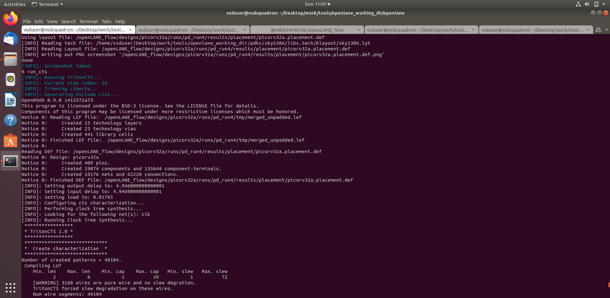
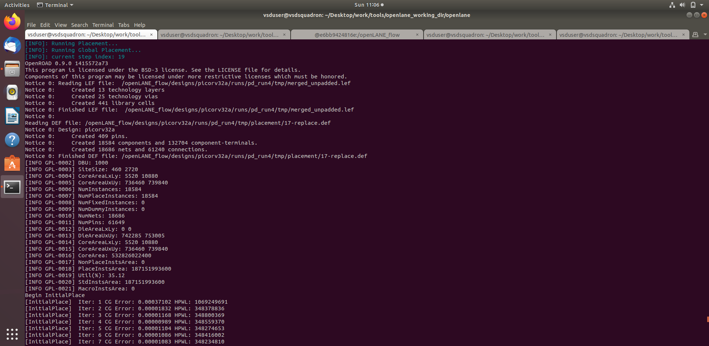
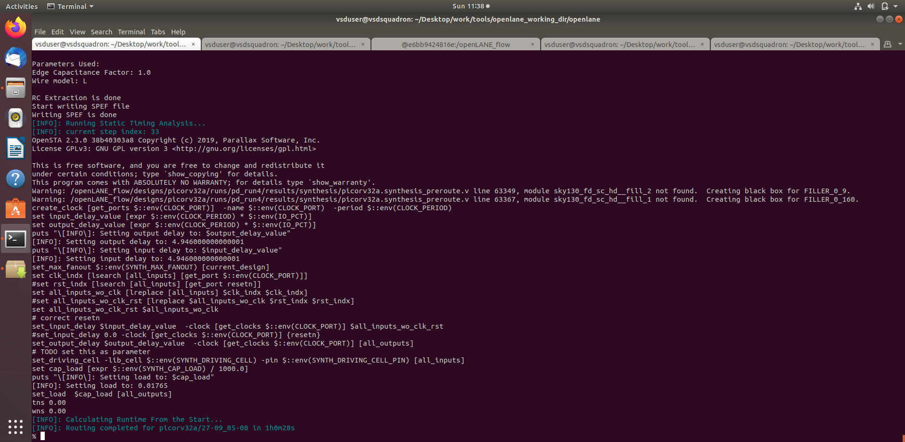

# Module 5: Clock Tree Synthesis, Placement, and Routing

This module covers the final stages of the backend digital design flow: clock tree synthesis, placement refinement, and routing. These steps are critical because they transform a logically correct design into a physically implementable and routable chip layout.

## Objectives

- Understand the role of clock tree synthesis (CTS)
- Learn how placement evolves during the backend flow
- Interpret the routing stage and its output files
- Understand the importance of signoff checks in physical design
- Connect the backend flow to the final implementation stage

## Key Concepts

### Clock Tree Synthesis (CTS)
CTS distributes the clock signal evenly across the chip to reduce skew and improve timing consistency. This is essential in large digital designs where clock delay variations can affect performance and functionality.

### Placement Refinement
After the initial placement, the design is optimized to improve timing, reduce congestion, and maintain legal cell placement. This step is important before routing begins.

### Routing
Routing connects the placed cells according to the netlist. It is one of the most complex and resource-intensive phases of physical design and directly impacts manufacturability and timing closure.

## Module Activities

- Review CTS flow and generated outputs
- Inspect placement updates after optimization
- Study routing execution and final backend results
- Understand how backend stages transition from placement to implementation

## Representative Outputs

## Typical Workflow

1. Run clock tree synthesis to distribute the clock network
2. Optimize placement for timing and routability
3. Perform routing across the design
4. Validate results and inspect generated reports
5. Prepare the design for signoff and physical verification

## Learning Outcome

By the end of this module, learners should understand how the design reaches its final physical implementation stage and why the last backend steps are crucial for successful silicon realization.

---

This module completes the PD program by demonstrating the final physical design stages needed to turn a digital design into a usable layout.
